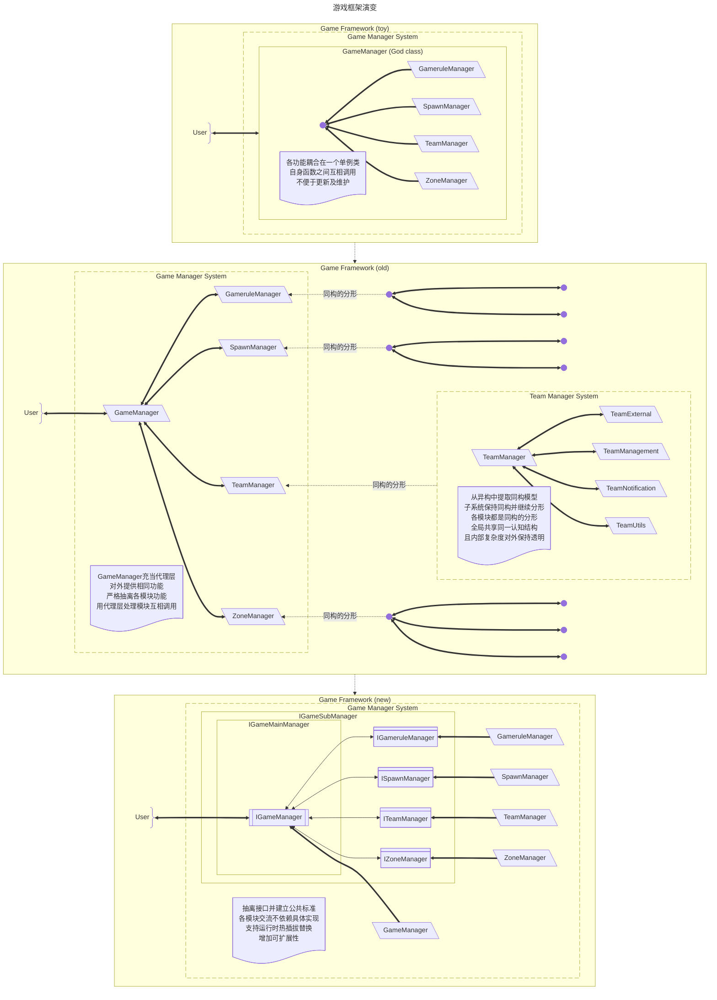
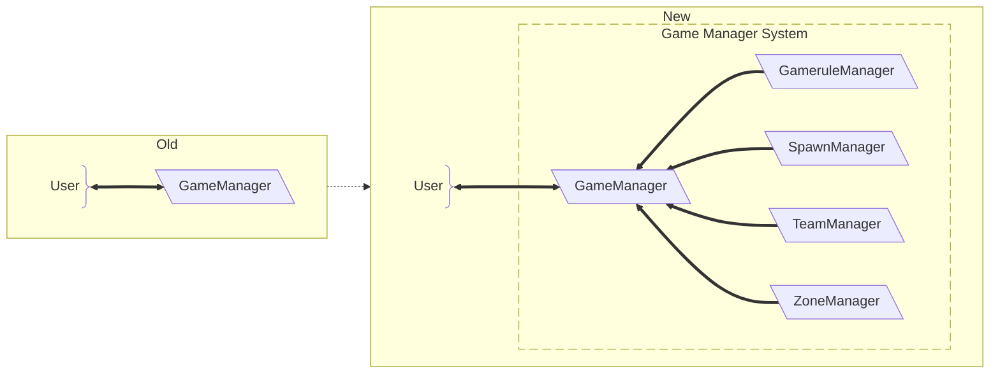
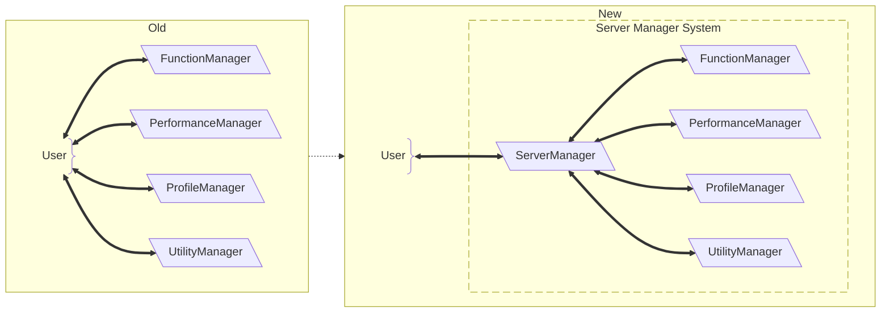
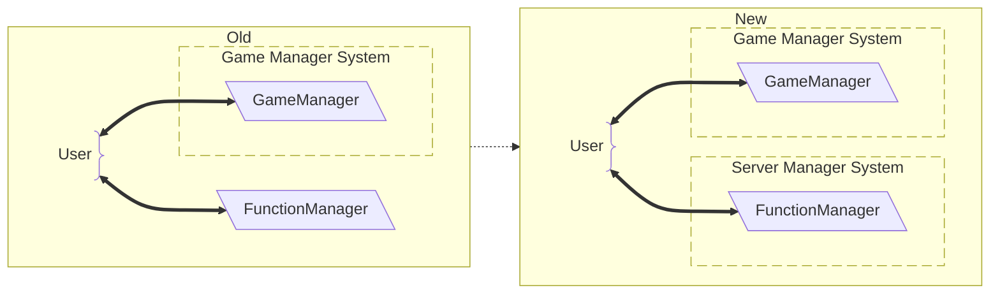
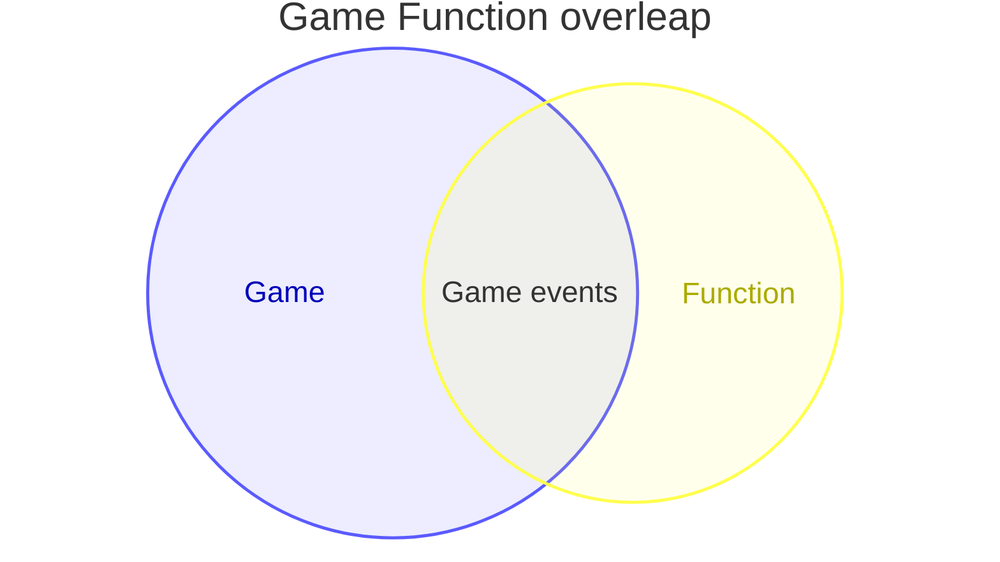

[English](#English)

## 同构分形

### 起源

从[游戏框架](/docs/architecture/common/game/game-framework.md)的重构开始演示，各阶段重构目标如下：
1. 玩具框架：
	- 项目初期，快速构建系统各模块占位（如`GameManager`，`ModConfigManager`、`LootGenerator`）以大致规划功能列表，之后在此包目录下开发
	- 各模块**聚合在同一个类**里
2. 旧框架：
	- 随着功能不断膨胀，将各模块抽离至子目录下
		- 抽离时保持原先`GameManager`已有的`startGame()`、`onGameTick()`、`stopGame()`生命周期结构（同构结构），而各自内部继续拆分（分形展开）
		- 此时`GameManager`的`onGameTick()`变为逐个调用各模块的`onGameTick()`，`GameManager`本身已成门面
			- 而抽离的子模块`TeamManager`**按相同模式继续抽离功能，成为新的门面**
	- 顺带地重新审视全局变量污染问题，避免模块之间共享内部状态
3. 新框架：
	- 制定标准接口进一步解耦
	- 各模块只需实现接口，而不以具体类为标准
	- 支持热插拔替换并增加扩展性
	- 扩展实现遵循相同接口及体系（同构），根据需求**替换或组合不同实现**（分形）

#### 起源-演示图

无论在系统各处，调用链均不超过两层门面`聚合门面`.`分形聚合门面`.`功能()`：
- 外部调用视角为`BattleRoyale.getGameManager()`.`getTeamManager()`.`func()`
```java
// 外部调用视角
void foo() {
	BattleRoyale.getGameManager().getTeamManager().func();
}
```
- 分形聚合门面`TeamManager`内部函数调用其他模块的视角为`IGameManager gameManager`.`getGameruleManager()`.`func()`
```java
// 分形聚合门面视角
void function(IGameManager gameManager) {
	gameManager.getGameruleManager().func();
}
```
- 通过聚合门面，对外将功能聚合在一个出口以提供便利，内部继续分形展开以明确分工
	- 从而实现**控制外部观测复杂度**，系统中任意节点的可见范围、影响范围不超过两层

### 熵管理

在同构分形的[起源](#起源)之后，基于其设计思想和经验，建立熵管理体系：

#### 背景

系统随功能更新而不断膨胀的过程中，通常呈现以下问题：
- 单一对象在垂直领域继续深化
- 单一对象堆叠更多水平职责
> 如`IGameMainManager`增加`IGameLobbyManager`、`IGameLootManager`、`IStatsManager`
- 模块间依赖关系不可控增长
- 重构成本随规模线性甚至指数增长

熵管理的核心目标：
- 不制止系统功能膨胀（熵增）
- 控制认知复杂度增长形态
	- 使系统可持续开发，利于浏览其他模块及便于新人入坑

#### 问题定义

定义系统认知复杂度为：
$$C_{obs} = f(M, T, K)$$
- $M$：模块数量
- $T$：结构类型复杂度
- $K$：跨模块认知切换成本

当各参数增长时，可能导致 $C_{obs} = O(n^2) \sim O(2^n)$

#### 基本操作

将系统结构统一约束为“同构递归树”，并通过[裂解](#裂解)与[聚合](#聚合)操作控制认知熵的局部分布

##### 同构分形结构

所有单元满足同一接口（如`IGameSubManager`），并允许递归定义：
- Manager -> SubManager
- SubManager -> SubSubManager

结构形式：
$$S = {N, E, R}$$
- N：节点（Manager）  
- E：父子关系  
- R：递归裂解规则

##### 裂解

将高熵节点拆分为子节点集合：
$$M \rightarrow DomainManager_M, \{M_1​, M_2​, ...\}$$
- 先有聚合门面，再裂解得到 $\{M_i\}$
> 如将`GameManager`的功能进行拆分（见[起源-演示图](#起源-演示图)）


##### 聚合

将语义一致的节点合并为领域单元：
$$\{M_1​, M_2​, ...\} \rightarrow DomainManager_M, \{M_1​, M_2​, ...\}$$
- 先有 $\{M_i\}$，再建立聚合门面
> 如对`IFunctionManager`、`IPerformanceManager`建立`IServerManager`


##### 分类根

当无法[裂解](#裂解)或[聚合](#聚合)时，引入稳定领域边界：

$$
M_1, N_1 \rightarrow
\begin{cases}
\text{DomainManager}_M \\
\text{DomainManager}_N
\end{cases}
$$



#### 认知复杂度模型

- 传统模型： $C_{traditional} = O(n)$
	- 多结构类型
	- 高跨模块切换成本
- 熵管理模型： $C_{FEM} = O(1)_{structure} + O(n)\_{local}$
	- $O(1)$：结构学习成本（统一规则）
	- $O(n)$：局部展开成本
	- 当大量使用[分类根](#分类根)而较少使用[裂解](#裂解)或[聚合](#聚合)时，熵管理模型会**退化为传统模型**
> 领域边界在结构层面同样满足 $O(1)$ 结构+ $O(n)$ 局部展开成本，例如：`IEffectManager`与`IGameManager`满足：
> - 相同分形规则
> - 相同裂解机制
> - 相同聚合规则
> - 仅领域边界不同
> 
> 从而 $Game \cong Effect$

对于模组扩展模型，系统支持：
- 替换`IGameSubManager`（如`IGameProcessManager`）-> 改变游戏模式
- 保持`IGameManager`及其体系不变
- 替换成本仅为单一子接口的实现，即 $Plugin = Replace(SubLayer)$

# English
