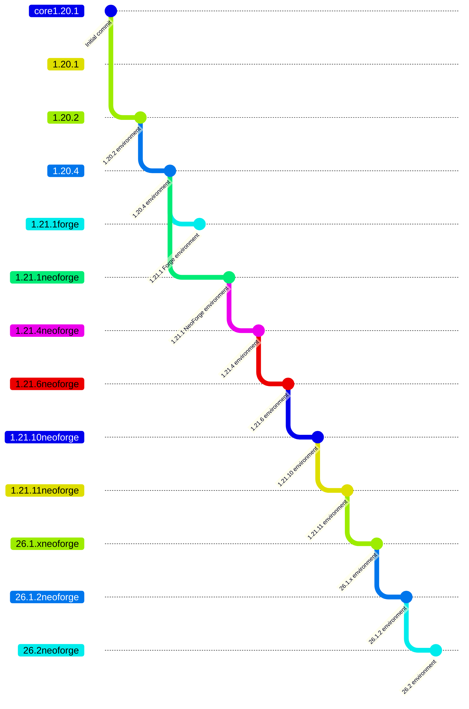
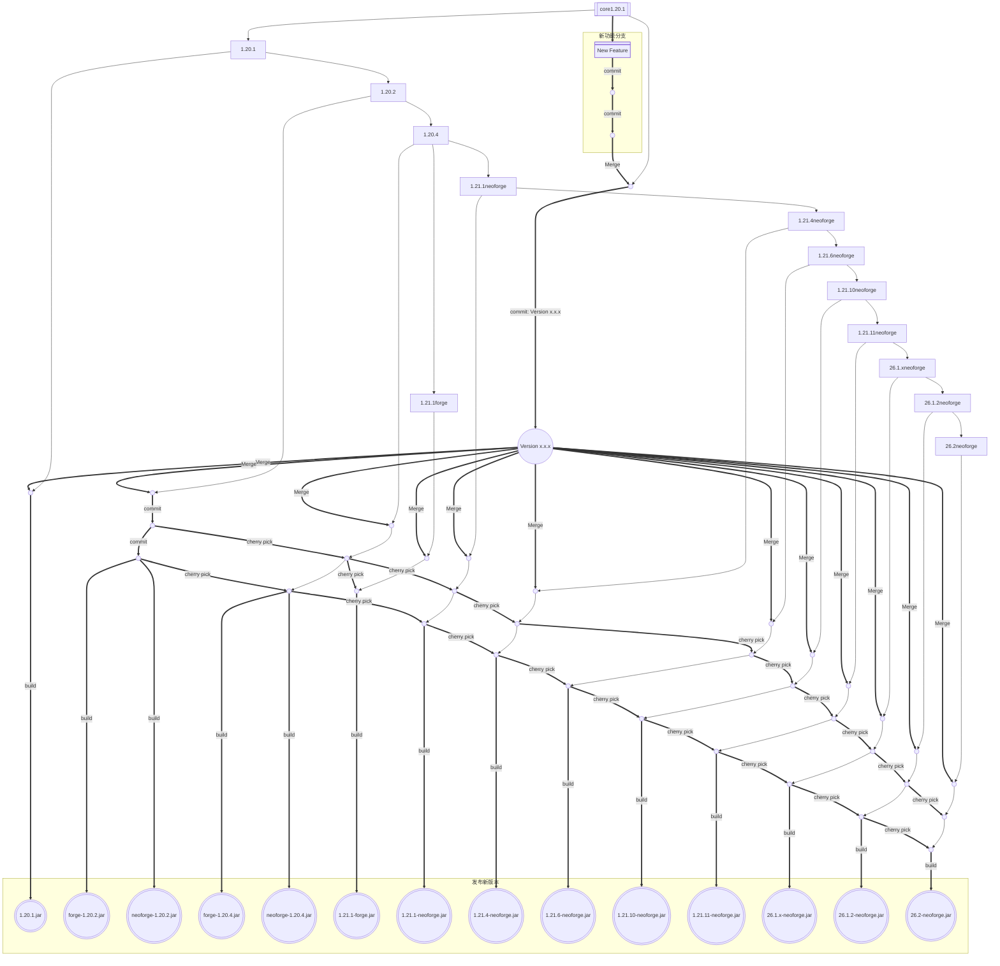

[English](#English)

# 跨版本开发流

## 分支

### 配置环境

配置各版本Gradle环境

```mermaid
---
config:
  gitGraph:
    mainBranchName: core1.20.1
---
gitGraph
	%% --------配置环境--------
	
    commit id:"Initial commit"
    
	%% 1.20.1
    branch "1.20.1" order:12001
    checkout "core1.20.1"
    
	%% 1.20.2
    branch "1.20.2" order:12002
    checkout "1.20.2"
    commit id:"1.20.2 environment"
    
	%% 1.20.4
    branch "1.20.4" order:12004
    checkout "1.20.4"
    commit id:"1.20.4 environment"
    
	%% 1.21.1forge
    branch "1.21.1forge" order:12101
    checkout "1.21.1forge"
    commit id:"1.21.1 Forge environment"
    
	%% 1.21.1neoforge
    checkout "1.20.4"
    branch "1.21.1neoforge" order:12102
    checkout "1.21.1neoforge"
    commit id:"1.21.1 NeoForge environment"
    
	%% 1.21.4neoforge
    branch "1.21.4neoforge" order:12104
    checkout "1.21.4neoforge"
    commit id:"1.21.4 environment"
	
	%% 1.21.6neoforge
    branch "1.21.6neoforge" order:12106
    checkout "1.21.6neoforge"
    commit id:"1.21.6 environment"
	
	%% 1.21.10neoforge
    branch "1.21.10neoforge" order:12110
    checkout "1.21.10neoforge"
    commit id:"1.21.10 environment"
	
	%% 1.21.11neoforge
    branch "1.21.11neoforge" order:12111
    checkout "1.21.11neoforge"
    commit id:"1.21.11 environment"
	
	%% 26.1.xneoforge
    branch "26.1.xneoforge" order:26100
    checkout "26.1.xneoforge"
    commit id:"26.1.x environment"
	
	%% 26.1.2neoforge
    branch "26.1.2neoforge" order:26102
    checkout "26.1.2neoforge"
    commit id:"26.1.2 environment"
	
	%% 26.2neoforge
    branch "26.2neoforge" order:26200
    checkout "26.2neoforge"
    commit id:"26.2 environment"
```

### 更新模组

核心代码在`1.20.1`开发，之后同步至其他分支：

```mermaid
flowchart TB
	%% subgraph 常驻分支
		core1.20.1[[core1.20.1]]
		1.20.1[1.20.1]
		1.20.2[1.20.2]
		1.20.4[1.20.4]
		1.21.1forge[1.21.1forge]
		1.21.1neoforge[1.21.1neoforge]
		1.21.4neoforge[1.21.4neoforge]
		1.21.6neoforge[1.21.6neoforge]
		1.21.10neoforge[1.21.10neoforge]
		1.21.11neoforge[1.21.11neoforge]
		26.1.xneoforge[26.1.xneoforge]
		26.1.2neoforge[26.1.2neoforge]
		26.2neoforge[26.2neoforge]
	%% end

	%% --------配置环境--------
	core1.20.1 --> 1.20.1
	1.20.1 --> 1.20.2
	1.20.2 --> 1.20.4
	1.20.4 --> 1.21.1forge & 1.21.1neoforge
	1.21.1neoforge --> 1.21.4neoforge
	1.21.4neoforge --> 1.21.6neoforge
	1.21.6neoforge --> 1.21.10neoforge
	1.21.10neoforge --> 1.21.11neoforge
	1.21.11neoforge --> 26.1.xneoforge
	26.1.xneoforge --> 26.1.2neoforge
	26.1.2neoforge --> 26.2neoforge

	%% --------新功能分支--------
	core1.20.1 ==> new-feature@{ shape: div-rect, label: "New Feature" }
	subgraph 新功能分支
		new-feature ==commit==> commit1@{ shape: sm-circ, label: "功能1" } ==commit==> commit2@{ shape: sm-circ, label: "功能2" }
	end
	commit2 ==Merge==> merge1
	core1.20.1 ---> merge1@{ shape: sm-circ, label: "merge1" }
	
	%% --------版本名--------
	merge1 =="commit: Version x.x.x"==> release((Version x.x.x))
	
	%% --------合并到其他版本--------
	
	%% 1.20.1
	release ==Merge==> merge2@{ shape: sm-circ, label: "merge2" }
	1.20.1 ---> merge2
	
	%% 1.20.2
	release ==Merge==> merge3@{ shape: sm-circ, label: "merge3" }
	1.20.2 ---> merge3
	
	%% 1.20.4
	release ==Merge===> merge4@{ shape: sm-circ, label: "merge4" }
	1.20.4 ----> merge4
	
	%% 1.21.1forge
	release ==Merge====> merge5@{ shape: sm-circ, label: "merge5" }
	1.21.1forge -----> merge5
	
	%% 1.21.1neoforge
	release ==Merge====> merge6@{ shape: sm-circ, label: "merge6" }
	1.21.1neoforge -----> merge6
	
	%% 1.21.4neoforge
	release ==Merge=====> merge7@{ shape: sm-circ, label: "merge7" }
	1.21.4neoforge ------> merge7
	
	%% 1.21.6neoforge
	release ==Merge======> merge8@{ shape: sm-circ, label: "merge8" }
	1.21.6neoforge -------> merge8
	
	%% 1.21.10neoforge
	release ==Merge=======> merge9@{ shape: sm-circ, label: "merge9" }
	1.21.10neoforge --------> merge9
	
	%% 1.21.11neoforge
	release ==Merge========> merge10@{ shape: sm-circ, label: "merge10" }
	1.21.11neoforge ---------> merge10
	
	%% 26.1.xneoforge
	release ==Merge=========> merge11@{ shape: sm-circ, label: "merge11" }
	26.1.xneoforge ----------> merge11
	
	%% 26.1.2neoforge
	release ==Merge==========> merge12@{ shape: sm-circ, label: "merge12" }
	26.1.2neoforge -----------> merge12
	
	%% 26.2neoforge
	release ==Merge===========> merge13@{ shape: sm-circ, label: "merge13" }
	26.2neoforge ------------> merge13
	
	%% --------同步多版本--------
	
	%% 1.20.2
	merge3 ==commit==> commit3@{ shape: sm-circ, label: "Port to 1.20.2" }
	commit3 ==commit==> commit4@{ shape: sm-circ, label: "Port to 1.20.2neoforge" }
	
	%% 1.20.4
	commit3 ==cherry pick==> cherrypick14@{ shape: sm-circ, label: "cherrypick14" }
	merge4 --> cherrypick14
	commit4 ==cherry pick==> cherrypick15@{ shape: sm-circ, label: "cherrypick15" }
	cherrypick14 --> cherrypick15
	
	%% 1.21.1forge
	cherrypick14 ==cherry pick==> cherrypick16@{ shape: sm-circ, label: "cherrypick16" }
	merge5 --> cherrypick16
	
	%% 1.21.1neoforge
	cherrypick14 ==cherry pick==> cherrypick17@{ shape: sm-circ, label: "cherrypick17" }
	merge6 --> cherrypick17
	cherrypick15 ==cherry pick==> cherrypick18@{ shape: sm-circ, label: "cherrypick18" }
	cherrypick17 --> cherrypick18

	%% 1.21.4neoforge
	cherrypick17 ==cherry pick==> cherrypick19@{ shape: sm-circ, label: "cherrypick19" }
	merge7 --> cherrypick19
	cherrypick18 ==cherry pick==> cherrypick20@{ shape: sm-circ, label: "cherrypick20" }
	cherrypick19 --> cherrypick20
	
	%% 1.21.6neoforge
	cherrypick19 ==cherry pick==> cherrypick21@{ shape: sm-circ, label: "cherrypick21" }
	merge8 --> cherrypick21
	cherrypick20 ==cherry pick==> cherrypick22@{ shape: sm-circ, label: "cherrypick22" }
	cherrypick21 --> cherrypick22

	%% 1.21.10neoforge
	cherrypick21 ==cherry pick==> cherrypick23@{ shape: sm-circ, label: "cherrypick23" }
	merge9 --> cherrypick23
	cherrypick22 ==cherry pick==> cherrypick24@{ shape: sm-circ, label: "cherrypick24" }
	cherrypick23 --> cherrypick24

	%% 1.21.11neoforge
	cherrypick23 ==cherry pick==> cherrypick25@{ shape: sm-circ, label: "cherrypick25" }
	merge10 --> cherrypick25
	cherrypick24 ==cherry pick==> cherrypick26@{ shape: sm-circ, label: "cherrypick26" }
	cherrypick25 --> cherrypick26

	%% 26.1.xneoforge
	cherrypick25 ==cherry pick==> cherrypick27@{ shape: sm-circ, label: "cherrypick27" }
	merge11 --> cherrypick27
	cherrypick26 ==cherry pick==> cherrypick28@{ shape: sm-circ, label: "cherrypick28" }
	cherrypick27 --> cherrypick28

	%% 26.1.2neoforge
	cherrypick27 ==cherry pick==> cherrypick29@{ shape: sm-circ, label: "cherrypick29" }
	merge12 --> cherrypick29
	cherrypick28 ==cherry pick==> cherrypick30@{ shape: sm-circ, label: "cherrypick30" }
	cherrypick29 --> cherrypick30

	%% 26.2neoforge
	cherrypick29 ==cherry pick==> cherrypick31@{ shape: sm-circ, label: "cherrypick31" }
	merge13 --> cherrypick31
	cherrypick30 ==cherry pick==> cherrypick32@{ shape: sm-circ, label: "cherrypick32" }
	cherrypick31 --> cherrypick32
	
	%% --------编译Jar--------
	merge2 ==build==> build1.20.1
	commit4 ==build==> build1.20.2forge & build1.20.2neoforge
	cherrypick15 ==build==> build1.20.4forge & build1.20.4neoforge
	cherrypick16 ==build==> build1.21.1forge
	cherrypick18 ==build==> build1.21.1neoforge
	cherrypick20 ==build==> build1.21.4neoforge
	cherrypick22 ==build==> build1.21.6neoforge
	cherrypick24 ==build==> build1.21.10neoforge
	cherrypick26 ==build==> build1.21.11neoforge
	cherrypick28 ==build==> build26.1.xneoforge
	cherrypick30 ==build==> build26.1.2neoforge
	cherrypick32 ==build==> build26.2neoforge
	
	%% --------发布新版本--------
	subgraph 发布新版本
		build1.20.1@{ shape: dbl-circ, label: "1.20.1.jar" }
		build1.20.2forge@{ shape: dbl-circ, label: "forge-1.20.2.jar" }
		build1.20.2neoforge@{ shape: dbl-circ, label: "neoforge-1.20.2.jar" }
		build1.20.4forge@{ shape: dbl-circ, label: "forge-1.20.4.jar" }
		build1.20.4neoforge@{ shape: dbl-circ, label: "neoforge-1.20.4.jar" }
		build1.21.1forge@{ shape: dbl-circ, label: "1.21.1-forge.jar" }
		build1.21.1neoforge@{ shape: dbl-circ, label: "1.21.1-neoforge.jar" }
		build1.21.4neoforge@{ shape: dbl-circ, label: "1.21.4-neoforge.jar" }
		build1.21.6neoforge@{ shape: dbl-circ, label: "1.21.6-neoforge.jar" }
		build1.21.10neoforge@{ shape: dbl-circ, label: "1.21.10-neoforge.jar" }
		build1.21.11neoforge@{ shape: dbl-circ, label: "1.21.11-neoforge.jar" }
		build26.1.xneoforge@{ shape: dbl-circ, label: "26.1.x-neoforge.jar" }
		build26.1.2neoforge@{ shape: dbl-circ, label: "26.1.2-neoforge.jar" }
		build26.2neoforge@{ shape: dbl-circ, label: "26.2-neoforge.jar" }
	end
```

# English
